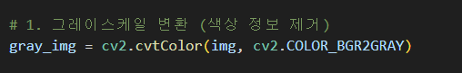
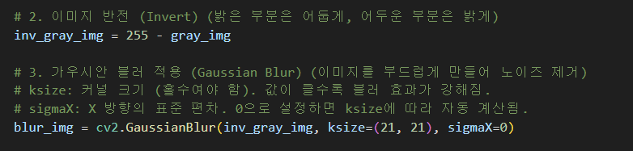
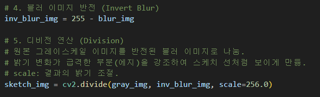
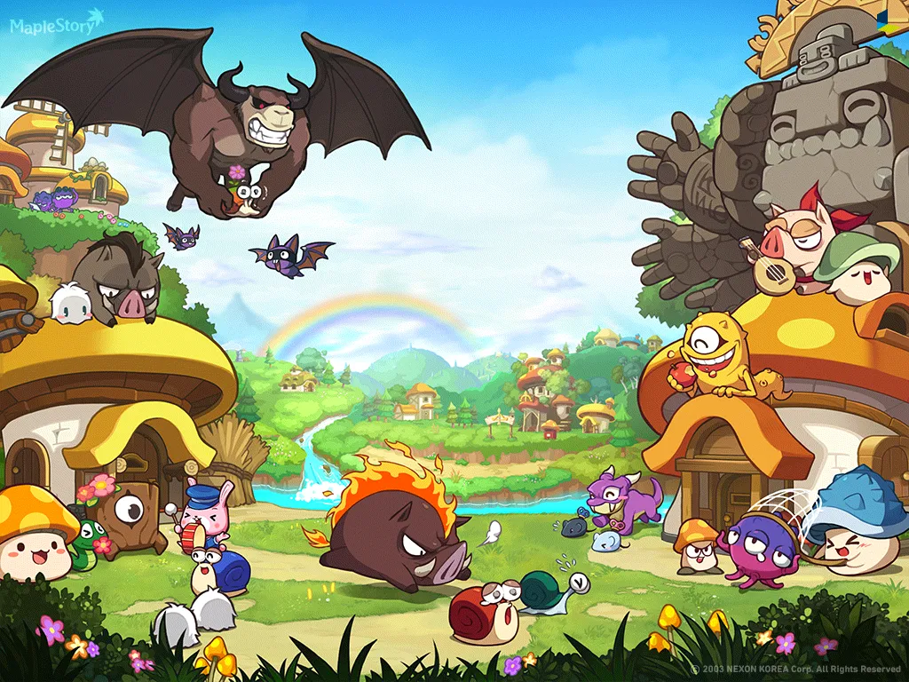
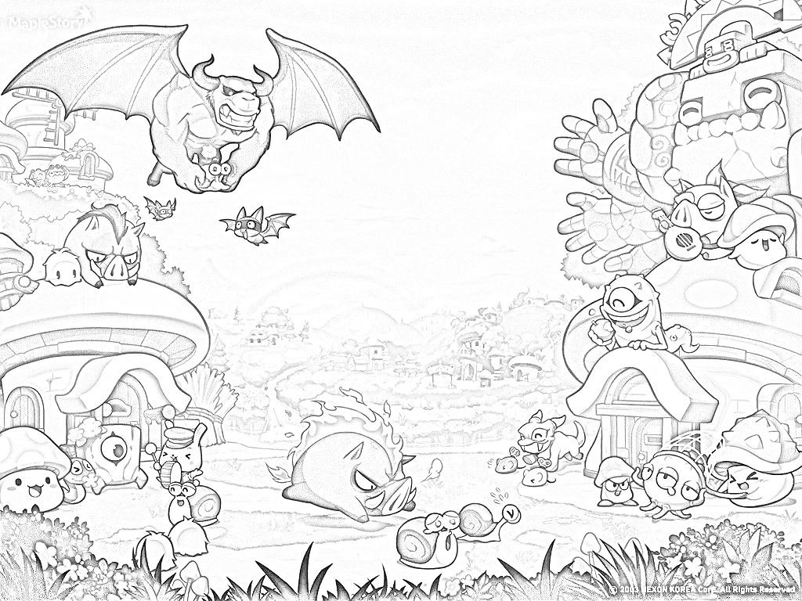
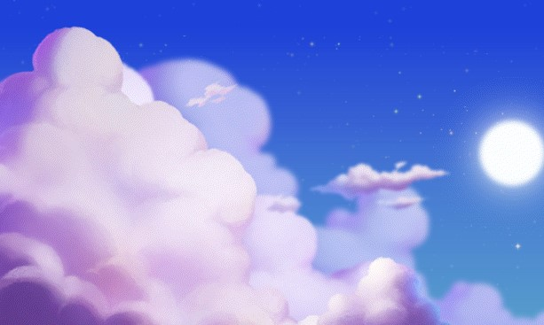
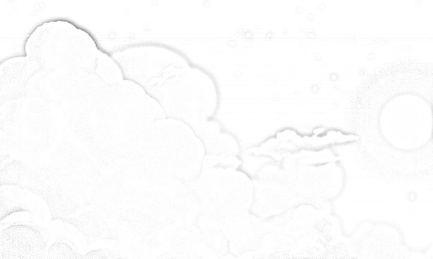

# SketchCartoon_Renderer

**OpenCV**의 이미지 프로세싱 기술을 활용하여 일반 사진을 **연필 스케치(Pencil Sketch)** 스타일로 변환하는 프로그램.

---

## 알고리즘 설명 및 구현

1. **Grayscale Conversion** : 색상 정보를 제거하고 밝기 값만 남겨 선 추출의 기반을 만듦.

2. **Inversion & Gaussian Blur** : 이미지를 반전시킨 후 Gaussian Blur를 적용하여 부드러운 배경 정보 생성.

3. **Division Operation** : 원본 Grayscale 이미지를 반전된 블러 이미지로 나눔. 이 과정에서 **밝기 변화가 급격한 부분(edge)**이 강조되어 연필로 그린 듯한 선을 생성
4. **Scaling** : 'scale=256.0'을 적용하여 최종 스케치 영상의 밝기를 최적화함.

---

## 데모 및 분석

### 1. 성공 사례
> **이미지 선정 기준** : 대비(Contrast)가 뚜렷하고 피사체의 윤곽이 명확한 사진

| 원본 이미지 | 변환 결과 (Pencil Sketch) |
| :--: | :--: |
|  |  |

 * **분석** : 캐릭터의 이목구비나 건물의 외곽선처럼 **경계선이 확실한 피사체**에서 뛰어난 스케치 효과를 보인다.

 ---

 ### 2. 실패 사례
 > **이미지 선정 기준** : 대비가 낮거나 질감이 너무 복잡하여 노이즈가 발생하는 사진

| 원본 이미지 | 변환 결과 (Pencil Sketch) |
| :--: | :--: |
|  |  |

* **분석** : 안개가 낀 풍경이나 어두운 밤 사진처럼 **명도 차이가 적은 경우**, 나눗셈 연산 결과가 흰색에 가까워져 형태가 소실된다. 또한 **질감이 너무 세밀한 이미지**는 디테일들이 검은 선으로 추출되어 지저분한 노이즈처럼 보인다.

---

### 3. 알고리즘의 한계점
* **1. 조명 및 대비 의존성** : 피사체와 배경의 밝기가 비슷하면(Low Contrast) 경계선을 전혀 인식하지 못하게 되어서 명확한 형태 보존을 저해하는 요인
* **2. 디테일 과부화(Noise)** : Gaussian Blur 커널 크기('k-size')가 고정되어 있어, 아주 세밀한 패턴이 있는 이미지에서는 생략이 일어나지 않고 모든 디테일이 검은 점으로 표현이 됨
* **3. 색상 정보의 부재** : 현재 알고리즘은 흑백 스케치에만 국한되어 있어 컬러플한 만화 스타일을 표현하기 위해서는 색을 보존하는 알고리즘과의 결합이 필요
